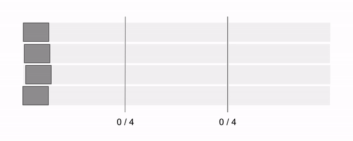

# @nlib/stream-tap

[](https://travis-ci.org/nlibjs/stream-tap)
[](https://ci.appveyor.com/project/kei-ito/stream-tap/branch/master)
[](https://codecov.io/gh/nlibjs/stream-tap)
[](https://david-dm.org/nlibjs/stream-tap)
[](https://david-dm.org/nlibjs/stream-tap?type=dev)

Put taps in a stream pipeline.

## Install

```
npm install @nlib/stream-tap
```

## Usage

### Tap

```javascript
const {PassThrough} = require('stream');
const {Tap} = require('@nlib/stream-tap');

const source = new PassThrough();
const tap = new Tap({isRunning: false});
const received = [];

source
.pipe(tap)
.on('data', (chunk) => {
  received.push(chunk);
});

source.write('1');
// received: []
source.write('2');
// received: []
tap.turnOn();
// received: ['1', '2']
source.write('3');
// received: ['1', '2', '3']
tap.turnOff();
// received: ['1', '2', '3']
source.end('4');
// received: ['1', '2', '3']
tap.turnOn();
// received: ['1', '2', '3', '4']
```

### TapGroup

```javascript
const {PassThrough} = require('stream');
const {TapGroup} = require('@nlib/stream-tap');

const source1 = new PassThrough();
const source2 = new PassThrough();
const tapGroup = new TapGroup({isRunning: false});
const received1 = [];
const received2 = [];

source1
.pipe(tapGroup.put())
.on('data', (chunk) => {
  received1.push(chunk);
});
source2
.pipe(tapGroup.put())
.on('data', (chunk) => {
  received2.push(chunk);
});

source1.write('1'); source2.write('1');
// received1: [], received2: []
source1.write('2'); source2.write('2');
// received1: [], received2: []
tapGroup.turnOn();
// received1: ['1', '2'], received2: ['1', '2']
source1.write('3'); source2.write('3');
// received1: ['1', '2', '3'], received2: ['1', '2', '3']
tapGroup.turnOff();
// received1: ['1', '2', '3'], received2: ['1', '2', '3']
source1.end('4'); source2.end('4');
// received1: ['1', '2', '3'], received2: ['1', '2', '3']
tap.turnOn();
// received1: ['1', '2', '3', '4'], received2: ['1', '2', '3', '4']
```

### StartingGate with Gulp

```javascript
const gulp = require('gulp');
const {StartingGate} = require('@nlib/stream-tap');

const gate = new StartingGate();

gulp.src('src/*.js')
.pipe(middleware1) // for example: minify codes
.pipe(middleware2) // rename files with hash string
.pipe(gate.put())
.pipe(gulp.dest('dest'))

gulp.src('src/*.html')
.pipe(gate.put())
.pipe(middleware3) // replace renamed urls
.pipe(gulp.dest('dest'))
```

## Javascript API

`require('@nlib/stream-tap')` returns `{Tap, TapGroup, StartingGate}`.

### Tap

#### new Tap({isRunning = false, onFlush = () => {}})

Create a tap. A tap is an instance of  [stream.Transform](https://nodejs.org/api/stream.html#stream_class_stream_transform). If it is not running (`tap.isRunning === false`), it buffers all data passed from overlying stream.

- **isRunning**<br>
  type: [`Boolean`](https://developer.mozilla.org/docs/Web/JavaScript/Reference/Global_Objects/Boolean)<br>
  default: `false`<br>
  The initial state of the tap.

- **onFlush**<br>
  type: [`Function`](https://developer.mozilla.org/docs/Web/JavaScript/Reference/Global_Objects/Function)<br>
  default: `() => {}`<br>
  The function called in the [transform._flush](https://nodejs.org/api/stream.html#stream_transform_flush_callback).<br>
  *Note*: The `finish` and `end` events are emitted when the tap is running after the **onFlush** is called.

#### Tap.prototype.isRunning

Type: [`Boolean`](https://developer.mozilla.org/docs/Web/JavaScript/Reference/Global_Objects/Boolean) (readonly)<br>
The state of the tap.

#### Tap.prototype.turnOn()

Returns: [`undefined`](https://developer.mozilla.org/docs/Web/JavaScript/Reference/Global_Objects/undefined)<br>
Turn on the tap.

#### Tap.prototype.turnOff()

Returns: [`undefined`](https://developer.mozilla.org/docs/Web/JavaScript/Reference/Global_Objects/undefined)<br>
Turn off the tap.

### TapGroup

Create a group of taps which creates taps and controls them.

#### new TapGroup({isRunning = false, onFlush = () => {}})

- **isRunning**<br>
  type: [`Boolean`](https://developer.mozilla.org/docs/Web/JavaScript/Reference/Global_Objects/Boolean)<br>
  default: `false`<br>
  The initial state of tapGroup.

- **onFlush**<br>
  type: [`Function`](https://developer.mozilla.org/docs/Web/JavaScript/Reference/Global_Objects/Function)<br>
  default: `() => {}`<br>
  The function called when taps in the group flushes all data.

#### TapGroup.prototype.isRunning

Type: [`Boolean`](https://developer.mozilla.org/docs/Web/JavaScript/Reference/Global_Objects/Boolean) (readonly)<br>
The state of the taps.

#### TapGroup.prototype.turnOn()

Returns: [`undefined`](https://developer.mozilla.org/docs/Web/JavaScript/Reference/Global_Objects/undefined)<br>
Turn on the taps.

#### TapGroup.prototype.turnOff()

Returns: [`undefined`](https://developer.mozilla.org/docs/Web/JavaScript/Reference/Global_Objects/undefined)<br>
Turn off the taps.

### StartingGate



**StartingGate** is a sub class of TapGroup.
It is turned on automatically when all streams before its taps flush all data.

```javascript
class StartingGate extends TapGroup {
  constructor() {
    super({
      isRunning: false,
      onFlush(tapGroup) {
        tapGroup.turnOn();
      },
    });
  }
};
```

## LICENSE

MIT
